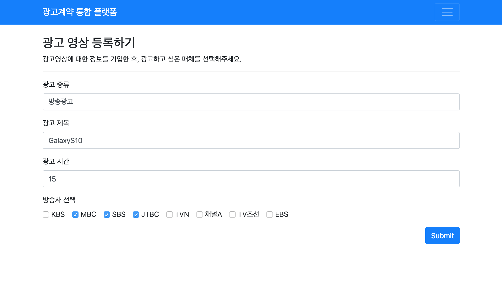
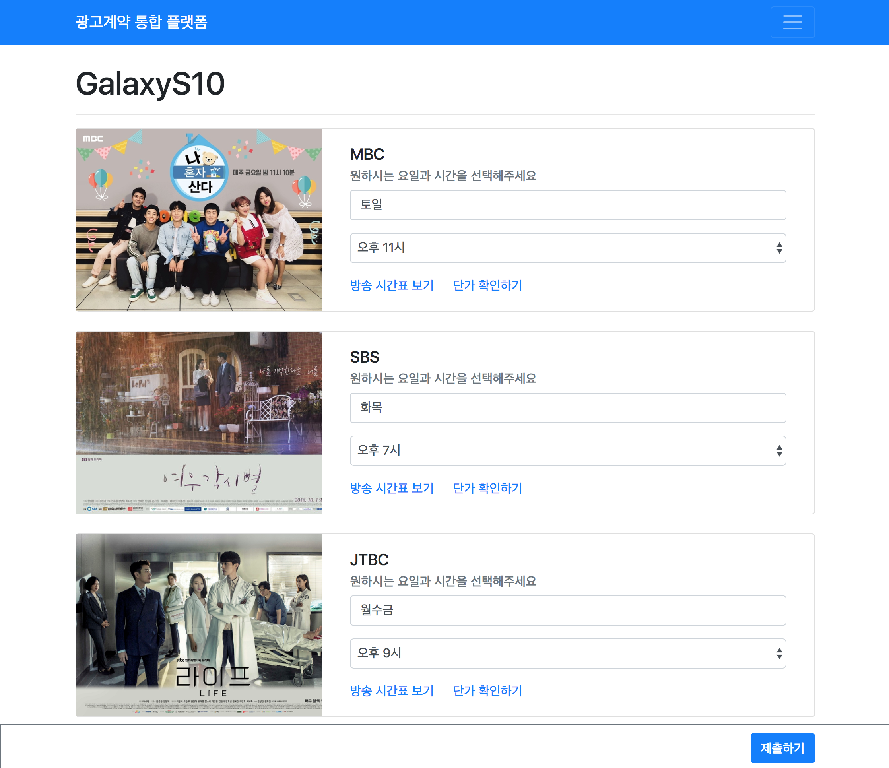

# Hyperledger Fabric 기반 광고 유통 통합 시스템
본 프로젝트는 BBR Hackathon 2018에 출품한 하이퍼렛져 패브릭 기반의 광고 유통 통합 시스템 DAPP 입니다. 기존 광고 유통의 문제를 블록체인을 통해 해결하며 훨씬 더 빠르고 투명한 계약이 가능하다는 장점이 있습니다.

팀원: [조상연]('http://github.com/csy1204') (Flask, Hyperledger Dapp), [이동건]('http://github.com/inspirit941')(Hyperledger Fabric & Composer)

## 0. 준비 사항
> Nvm, Npm, Node 필요
> nvm use --lts 을 통해 최신 Node 버젼 유지
> python3 필요 (flask, requests 라이브러리 설치 필요)

## 1. Blockchain 구조 설명 (bbrnet)

### Participant

1. Advertiser
2. AdAgency
3. MediaRep
4. MediaAgent

```
// PARTICIPANTS
abstract participant Person identified by personId {
  o String personId
  o String name
}

participant Advertiser extends Person {
}

participant AdAgency extends Person {
  // o String agencyName
}

participant MediaRep extends Person {
  // o String mediaRepName
}

participant MediaAgent extends Person {
  // o String mediaAgentName
}
```

### Asset: adContract
```
  o String contractId
  --> Advertiser owner
  --> AdAgency adagency
  --> MediaRep mediarep
  --> MediaAgent mediaagent
  o AdDetails adDetails
  --> Person [] approval
  o String days
  o String times
  o String programTitle
  o ContractStatus status
  o String closeReason optional
  o String closePerson optional
  o Integer count default=0
```
### Transaction

```
// TRANSACTIONS + EVENTS
    transaction InitialApplication {
    o String contractId
    o String owner
    o String adagency
    o String mediarep
    o String mediaagent
    o AdDetails adDetails
    o String days 
    o String times
    o String programTitle
    }


    transaction Approve {
    --> AdContract adc
    --> Person approvingParty
    }

    transaction Commit {
    --> AdContract adc
    }

    transaction Reject {
    --> AdContract adc
    --> Person rejectingParty
    o String closeReason
    }
    
    transaction ViewCount{
    --> AdContract adc
    }

    // TRANSACTIONS FOR SETUP
    transaction CreateDemoParticipants {
    }
```
### Transaction Logic Chaincode 
```javascript
/**
 * Create the AdContract asset
 * @param {org.example.biznet.InitialApplication} initalAppliation - the InitialApplication transaction
 * @transaction
 */
async function initialApplication(application) { // eslint-disable-line no-unused-vars
    const factory = getFactory();
    const namespace = 'org.example.biznet';
    
    const letter = factory.newResource(namespace, 'AdContract', application.contractId);
    letter.owner = factory.newRelationship(namespace, 'Advertiser', application.owner); // owner
    letter.adagency = factory.newRelationship(namespace, 'AdAgency', application.adagency); // adagency
    letter.mediarep = factory.newRelationship(namespace, 'MediaRep', application.mediarep);
    letter.mediaagent = factory.newRelationship(namespace, 'MediaAgent', application.mediaagent);
    letter.adDetails = application.adDetails;
    letter.approval = [
        factory.newRelationship(namespace, 'Advertiser', application.owner)
        ,factory.newRelationship(namespace, 'AdAgency', application.adagency)];
        // 광고주, 광고대행사 두 개체는 실행 시점에서 이미 허락한 것으로 간주하기에 
        // relation을 두 개 걸어둔다.

    letter.days = application.days;
    letter.times = application.times;
    letter.programTitle = application.programTitle;
    letter.status = 'AWAITING_APPROVAL';

    //save the application
    const assetRegistry = await getAssetRegistry(letter.getFullyQualifiedType());
    await assetRegistry.add(letter);

}
```

## 2. Dapp-FrontEnd 구조 설명 (frontend)
Dapp 프론트는 광고 대행사의 입장으로 구성되어 있으며 크게 계약 생성 및 조정, 계약 확인으로 구성되어 있다. 광고 대행사는 이전에 번거롭게 여러 미디어렙 및 매체사와 접촉할 필요 없이 같은 광고 소스로 여러 매체와 계약이 가능하다. 먼저 등록할 광고를 선택하고 각 매체별 편성을 정한 후 스마트 컨트랙트를 생성한다.
이후 각 참여자들이 서명을 통해 승인함으로써 계약이 성사되고 실제 광고 집행도 간략하게 나마 측정할 수 있다.

## 광고 등록 페이지


## 매체별 편성 설정 페이지


## 계약 확인 페이지

